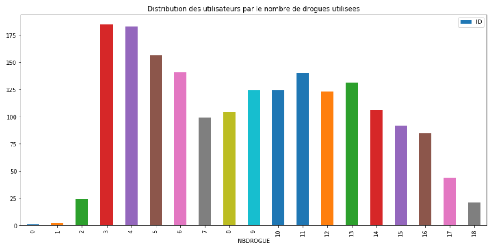

# Python_for_data_analysis

# Contexte 

Dans le cadre du cours Python for Data Analysis donné par Mr Romain Jouin, il est demandé de mettre en pratique les différentes compétences nécessaires au métier de data-scientist vues en cours cette année. Pour cela, il est demandé de faire une analyse d'un dataset en visualisant, préparant et modélisant les données. 

# Base de données 
## Drug Consumption 

La base de données contient des enregistrements pour 1885 répondants. Pour chaque répondant, 12 attributs sont connus: 
* les mesures de personnalité comprenant : 
    * NEO-FFI-R (neuroticisme, extraversion, ouverture à l'expérience, agrément et conscience), 
    * BIS-11 (impulsivité) 
    * ImpSS (recherche de sensations), 
* niveau d'éducation, 
* âge, 
* sexe, 
* pays de résidence
* appartenance ethnique. 

Tous les attributs d'entrée sont à l'origine catégoriques et sont quantifiés. Après la quantification, les valeurs de toutes les entités en entrée peuvent être considérées comme des valeurs réelles. 

En outre, les participants ont été interrogés sur l’utilisation de 18 drogues licites et illégales : 
* alcool, 
* amphétamines, 
* nitrite d’amyle, 
* benzodiazépine, 
* cannabis, 
* chocolat, 
* cocaïne, 
* caféine, 
* ecstasy, 
* héroïne, 
* kétamine, 
* hauts légaux, 
* LSD, 
* méthadone, 
* champignons
* etc. 

La base de données contient 18 problèmes de classification. Chacune des variables d'étiquette indépendantes contient sept classes: 
* "Jamais utilisé", 
* "Utilisé il y a une décennie", 
* "Utilisé au cours de la dernière décennie", 
* "Utilisé l'année dernière", 
* "Utilisé le mois dernier", 
* "Utilisé la semaine dernière", 
* "utilisé aujourd'hui".

# Objectif
La cible à prédire est le risque de consommer une drogue sachant le profil de l'utilisateur et ses consommations des autres drogues. 
Pour une visualisation optimale, il faut pour le préparer simplement appliquer des dictionnaires pour changer les valeurs numériques en valeur compréhensibles.
Je vais appliquer différents modèles de machine learning, comme le SVM, le K-NN, et le Random Forest pour une drogue afin d'optimiser les hyperparamètres.
Et enfin j'automatiserai la modélisation sur
toutes les drogues pour obtenir un tableau comparatif des scores de chacun des modèles pour chacunes des drogues.

# Importation des données 
A partir de l'url https://archive.ics.uci.edu/ml/machine-learning-databases/00373/drug_consumption.data je récupère la page à l'aide d'une requête.
Une fois cette requête réalisée, je peux récupérer le contenu de la page et, grâce à BeautifulSoup je peux le parser et obtenir les valeurs de la balise 
. Grâce à la libraire Pandas, je copie toutes ces données dans un nouveau fichier CSV. 

# Préparation des données
Toutes les données sont numériques. Grâce à la documentation obtenues sur https://archive.ics.uci.edu/ml/datasets/Drug+consumption+%28quantified%29 j'ai pu transformer ces données en valeur lisibles et compréhensibles. 

# Visualisation des données 
## Distribution des utilisateurs par le nombre de drogues utilisées

## Classement des drogues légales et illégales les plus utilisées hier

## Distribution des drogués de cocaïne en fonction de l'age

## Distribution des drogués de cocaïne en fonction de son pays d'origine

# Modélisation

## Détermination des hyperparamètres 

### Support Vector Machine (SVM)
En essaytn avec différents valeurs de gamma, j'obtiens le meilleur résultat avec gamma = 0,7.

### K-Nearest Neighbors (KNN)
Je détermine la meilleure valeur de K estimators. 

Dans ce cas d'exemple, je trouve un K=14 avec une précision de 0.783. 

### Random Forest 
Je détermine la meilleure valeur de N estimators. 

Dans ce cas d'exemple, je trouve un N = 63 avec une précision de 0.793.

## Automatisation 

A l'aide d'une boucle sur toutes les colonnes de drogues, je sépare le dataset pour le training et l'apprentissage avec la fonction .fit, puis je prédit et enfin je peux évaluer le score des modèles. 

# Résultats et conclusion

Grâce à ce tableau, je peux voir quel modèle est le plus apte à prédire la consommation des différentes drogues. 

